# FlexiSphere

This component is similar to the public component Quartz, We will discuss the differences between Quartz and FlexiSphere later
I used to design and build these kinds of tools/components to learn how to create them and to tailor the behaviors to more specific needs.

So, this component left aside:

- the persistence logic, but if you want to extend this behavior, is easy to accomplish, using OnBeforeJob, OnAfterjob
- The logging configuration, We use ILogger (NLog), and you can configure it to change the trace level, or the logging destination, GrayLog, console, file, etc

Realted interfaces/components

- [IFlexiSphereTrigger](./IFlexiSphereTrigger.md)
- [IFlexiSphereJob](./IFlexiSphereJob.md)

## Hands-on

This component requires atleast one trigger, and one job to work

The triggers are activated by the FlexiSphere, and when a trigger is triggered send a notification to FlexiSphere,

When FlexiSphere gets the event, loop the jobs defined, and execute on every job ExecuteAsync
TimeSphere is responsilbe to throw events like:

- OnTriggered
- OnTriggerCompleted
- OnBeforeJob
- OnAfterJob
- OnCancelled
- OnFaulted

Sequence diagram:

Class diagram:

```mermaid
classDiagram
    interface IFlexiSphereContext

    class IFlexiSphere {
        +IReadOnlyCollection~IFlexiSphereTrigger~ Triggers
        +IReadOnlyCollection~IFlexiSphereJob~ Jobs
        +int Counter
        +StartAsync()
    }

    class IFlexiSphereTrigger {
        +ActivateTrigger(IFlexiSphereContext)
    }

    class IFlexiSphereJob {
        +ExecuteAsync(IFlexiSphereContext)
    }

    IFlexiSphere "1" --> "1..*" IFlexiSphereTrigger
    IFlexiSphere "1" --> "1..*" IFlexiSphereJob
```

